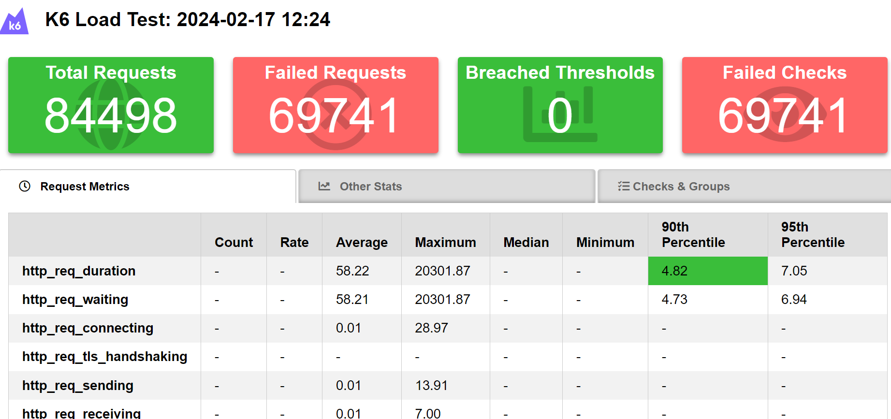
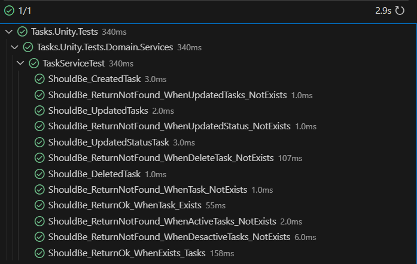

# Projeto para criação de tasks a fazer, feitas e completadas

## Funcionalidades

- Criação de Tasks
- Deleção Lógica de tasks
- Consulta por id de tasks
- Consulta de tasks por filtro de ativas e range de datas

## Tecnologias utilizadas

- .NET 8.0
- Web API
- MongoDB (API)
- Docker
- k6 (testes de stress)

## Iniciando a aplicação

- Para iniciarmos a aplicação basta rodar o comando

``` docker-compose up ```

nele já está configurado tudo que necessitamos para a subida da api.

com isso basta acessar a aplicação pelo : <http://localhost:8080/swagger/index.html>

## Instalação k6

Para rodarmos o teste de carga necessitamos instalar o k6 no powershell para isso
execute o comando:

[k6 - intalação](https://k6.io/docs/get-started/installation/)

``` winget install k6 --source winget no powershell ```

- reinicie powerShell

- após instalado navegue até o diretório "testes-stress" e execute o comando

``` k6 run todo-list.js ```

no arquivo js está configurado uma rota da aplicação para poder iniciar os testes de cargas para a aplicação.
Após finalizada ele gerará um arquivo html com algumas informações para em um caso real conseguirmos escalonar a aplicação de forma adequada.

Para exemplificar quando rodado eu desliguei o mongo para forçar falhas de request onde eu só considerava status code 200 e 404 como sucesso.

e o resultado foi:



## Testes de unidade da aplicação

